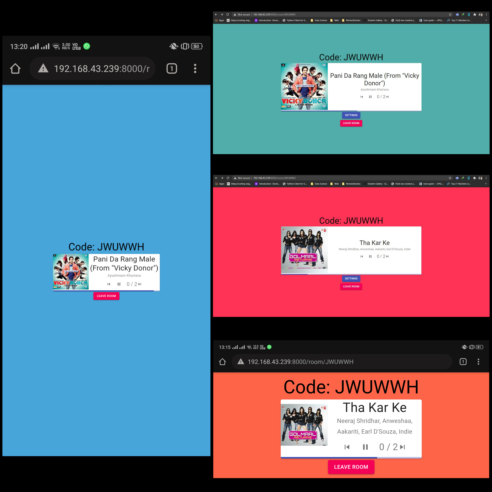

# Music-Spot

- A full-stack Django-React app that uses Spotify API to let users create and join music rooms for partying &amp; chilling.
- The app is a multi-person controlled music player that can be enjoyed on a Local Area Network(LAN).
- The music in the app plays in the Spotify app and not in the web app.
- The app allows users to cast vote for skipping a song.
- The host needs to have Spotify Premium to access the functionality of pausing/skipping a song.

## Tech Stack
- Python
- JavaScript
- Django
- React.js
- Spotify API

## Steps to run
- Open terminal and run the below command 
`pip install -r requirements.txt`
- Go to the repository using cd and run the below commands 
`python manage.py makemigrations` 
`python manage.py migrate`

### Start Django Web Server
Run the below command 
`python manage.py runserver`

### Install Node.js
Download node.js in your system using this [link](https://nodejs.org/en/download/)

### Install Node Modules
- cd into the frontend directory of the repository
- Install the node modules using below command 
`npm i`

### Run React/Node Server
- Compile the frontend (all node modules) using command 
`npm run dev` (for development) 
`npm run build` (in production)
